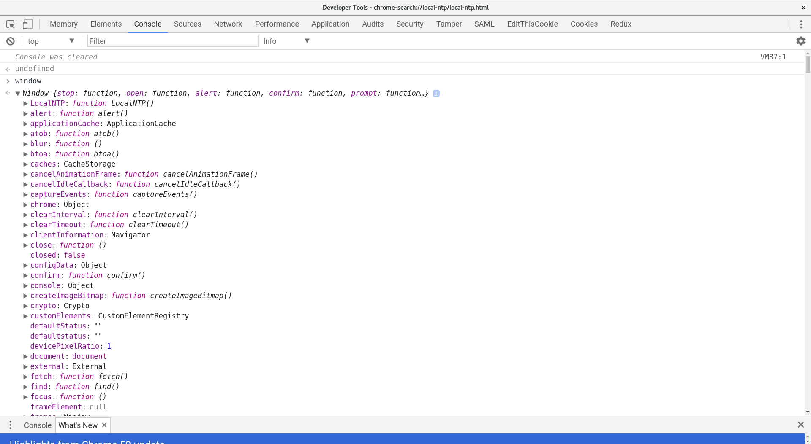

# Browser vs Node.js

Is same code can be executed in chrome javascript engine as well as in nodejs since both are based on v8 engine. Well yes & no, I am not trying to create confusing here, but although both are based out of v8 engine. Still there is a difference between the ways of handling javascript code.

One resides inside your browser while other runs directly over os layer. In browser everything revoles around document object model \(dom\) while inside nodejs echo system, we don't have anything like dom.

To verify this open your browser javascript console and in seperate terminal type node. Type document in the chrome console.




Open a terminal and type node.

```text
> document
ReferenceError: document is not defined
    at repl:1:1
    at ContextifyScript.Script.runInThisContext (vm.js:23:33)
    at REPLServer.defaultEval (repl.js:336:29)
    at bound (domain.js:280:14)
    at REPLServer.runBound [as eval] (domain.js:293:12)
    at REPLServer.onLine (repl.js:533:10)
    at emitOne (events.js:101:20)
    at REPLServer.emit (events.js:191:7)
    at REPLServer.Interface._onLine (readline.js:238:10)
    at REPLServer.Interface._line (readline.js:582:8)
> window
ReferenceError: window is not defined
    at repl:1:1
    at ContextifyScript.Script.runInThisContext (vm.js:23:33)
    at REPLServer.defaultEval (repl.js:336:29)
    at bound (domain.js:280:14)
    at REPLServer.runBound [as eval] (domain.js:293:12)
    at REPLServer.onLine (repl.js:533:10)
    at emitOne (events.js:101:20)
    at REPLServer.emit (events.js:191:7)
    at REPLServer.Interface._onLine (readline.js:238:10)
    at REPLServer.Interface._line (readline.js:582:8)
```

You can see the difference in browser and node js console. document and window keywords are not defined inside node.js echo system while in browser, they provide you details about each in details. if you observe closely window keyword expose all the api's that can be used to call or modify specific element in the browser.[  
](https://akoserwal.gitbooks.io/how-it-feels-to-learn-javascript/content/chapter1/nodejs.html)

